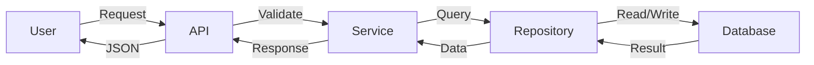

# Architecture Design

Transform a high-level plan into detailed technical architecture.

## Input
`$ARGUMENTS` - Plan reference or task description (reads specs/plan.md if exists)

## Process

### Step 1: Read the Plan

Load and understand:
- specs/plan.md (selected approach)
- Existing codebase structure
- project.config.json (stack info)

### Step 2: Define File Structure

```markdown
## File Structure

```
project/
├── src/
│   ├── core/           # Core business logic
│   │   ├── __init__.py
│   │   ├── models.py   # Data models
│   │   └── service.py  # Business logic
│   ├── api/            # External interfaces
│   │   ├── __init__.py
│   │   └── routes.py   # API endpoints
│   └── utils/          # Shared utilities
│       └── helpers.py
├── tests/
│   ├── test_models.py
│   ├── test_service.py
│   └── test_api.py
└── pyproject.toml
```
```

### Step 3: Define Interfaces

For each module, define:

```markdown
## Interfaces

### models.py

```python
from dataclasses import dataclass
from typing import Optional
from datetime import datetime

@dataclass
class Item:
    """Represents a single item."""
    id: str
    name: str
    created_at: datetime
    metadata: Optional[dict] = None
```

### service.py

```python
from typing import Protocol

class ItemRepository(Protocol):
    """Interface for item persistence."""

    def get(self, id: str) -> Item | None: ...
    def save(self, item: Item) -> None: ...
    def delete(self, id: str) -> bool: ...
    def list_all(self) -> list[Item]: ...
```
```

### Step 4: Data Flow Diagram

```markdown
## Data Flow


```

### Step 5: Dependencies

```markdown
## Dependencies

### Runtime
- fastapi >= 0.100.0  # Web framework
- pydantic >= 2.0     # Data validation

### Development
- pytest >= 7.0       # Testing
- ruff >= 0.1.0       # Linting
- pyright >= 1.1      # Type checking
```

### Step 6: Test Strategy

```markdown
## Test Strategy

### Unit Tests
- models.py: Test data validation, serialization
- service.py: Test business logic with mocked repository

### Integration Tests
- api/routes.py: Test endpoints with test client

### E2E Tests (if web)
- Full user flows via Puppeteer
```

### Step 7: Generate Features

Create granular feature list for specs/features.json:

```json
{
  "features": [
    {
      "id": "F001",
      "category": "core",
      "description": "Create Item model with validation",
      "files": ["src/core/models.py"],
      "tests": ["tests/test_models.py"],
      "passes": false
    },
    {
      "id": "F002",
      "category": "core",
      "description": "Implement ItemService with CRUD operations",
      "files": ["src/core/service.py"],
      "tests": ["tests/test_service.py"],
      "depends_on": ["F001"],
      "passes": false
    }
  ]
}
```

## Output

### specs/architecture.md

Complete architecture document with all sections above.

### specs/features.json

Feature list with:
- Unique IDs
- Dependencies between features
- Associated files and tests
- All initially passes: false

## Quality Checklist

- [ ] File structure is clear and follows project conventions
- [ ] All interfaces have type hints
- [ ] Data flow is documented
- [ ] Dependencies are listed with versions
- [ ] Test strategy covers all components
- [ ] Features are granular and independent
- [ ] specs/architecture.md is saved
- [ ] specs/features.json is saved
