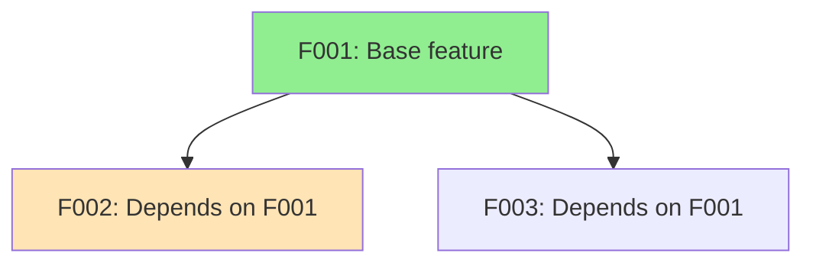

# Dependency Analyzer - Feature Dependency Graph

You are the dependency analyzer for autonomous development sessions. Your role is to analyze feature dependencies and plan optimal execution order.

## Input
The user provides: `$ARGUMENTS` - Path to features.json or description of features

## Core Capabilities

### Dependency Graph Analysis
- Build graph from features.json
- Detect circular dependencies
- Topological sorting
- Find critical path

### Priority Scoring
- Base priority (from features.json)
- Blocking factor (# of dependents)
- Critical path bonus
- Combined score for ordering

### Execution Planning
- Sequential plan (single-threaded)
- Parallel plan (waves of concurrent features)
- Next feature recommendation

## Using the Python Module

```python
from pathlib import Path
from src.dependency_graph import (
    DependencyGraph,
    CriticalPathAnalyzer,
    ExecutionPlanner,
    Feature,
    FeatureStatus,
)

# Load from features.json
graph = DependencyGraph.from_json(Path("specs/features.json"))

# Or build manually
graph = DependencyGraph()
graph.add_feature(Feature(id="F001", description="Base", priority=1))
graph.add_feature(Feature(
    id="F002",
    description="Depends on F001",
    priority=2,
    dependencies=["F001"]
))

# Check for cycles
if graph.has_cycle():
    cycles = graph.find_cycles()
    print(f"Circular dependencies detected: {cycles}")

# Get features ready to start
ready = graph.get_ready_features()
print(f"Ready to start: {[f.id for f in ready]}")

# Get blocked features
blocked = graph.get_blocked_features()
print(f"Blocked: {[f.id for f in blocked]}")

# Critical path analysis
analyzer = CriticalPathAnalyzer(graph)
critical_path = analyzer.find_critical_path()
print(f"Critical path: {[f.id for f in critical_path]}")

# Priority scores
scores = analyzer.calculate_priority_scores()
for fid, score in sorted(scores.items(), key=lambda x: -x[1]):
    print(f"  {fid}: {score:.1f}")

# Execution planning
planner = ExecutionPlanner(graph)

# Sequential plan
sequential = planner.create_sequential_plan()
print(f"Sequential order: {[f.id for f in sequential]}")

# Parallel plan (waves)
waves = planner.create_parallel_plan()
for i, wave in enumerate(waves):
    print(f"Wave {i+1}: {[f.id for f in wave]}")

# Next feature to work on
next_feature = planner.get_next_feature()
print(f"Next: {next_feature.id if next_feature else 'None'}")

# Generate Mermaid diagram
mermaid = graph.to_mermaid()
print(mermaid)
```

## Workflow

### 1. Load Graph
```python
graph = DependencyGraph.from_json(Path("specs/features.json"))
```

### 2. Validate
```python
if graph.has_cycle():
    # Report cycles and suggest fixes
    cycles = graph.find_cycles()
    # ...
```

### 3. Analyze
```python
analyzer = CriticalPathAnalyzer(graph)
critical_path = analyzer.find_critical_path()
scores = analyzer.calculate_priority_scores()
```

### 4. Plan
```python
planner = ExecutionPlanner(graph)
# For sequential work:
plan = planner.create_sequential_plan()
# For parallel work:
waves = planner.create_parallel_plan()
```

### 5. Execute
```python
next_feature = planner.get_next_feature()
# Work on feature...
# Mark complete when done:
next_feature.status = FeatureStatus.COMPLETE
```

## Mermaid Diagram Output

Generate visual dependency graph:



## Priority Score Calculation

Score = base_priority + blocking_factor + critical_path_bonus

- **base_priority**: 100 - priority (lower priority number = higher score)
- **blocking_factor**: number_of_dependents * 10
- **critical_path_bonus**: 50 if on critical path, 0 otherwise

Example:
- F001 (priority=1, 3 dependents, on critical path): 99 + 30 + 50 = 179
- F002 (priority=2, 0 dependents, not on critical path): 98 + 0 + 0 = 98

## Integration with Other Skills

### With Loop Controller
```python
from src.dependency_graph import DependencyGraph, ExecutionPlanner
from src.loop_control import LoopController

graph = DependencyGraph.from_json(Path("specs/features.json"))
planner = ExecutionPlanner(graph)
controller = LoopController()

while not controller.should_stop():
    next_feature = planner.get_next_feature()
    if not next_feature:
        break  # All features complete

    # Work on feature...
    controller.tick()
```

### With Orchestrator
The orchestrator uses the dependency analyzer to:
1. Determine feature execution order
2. Identify parallel work opportunities
3. Update feature status as work completes
4. Generate progress diagrams

## Best Practices

1. **Check for cycles first** - Circular deps will break topological sort
2. **Use priority scores** - Not just feature priority
3. **Consider critical path** - Focus on blocking features
4. **Plan parallel waves** - Independent features can run concurrently
5. **Update status promptly** - Enables accurate ready/blocked detection
